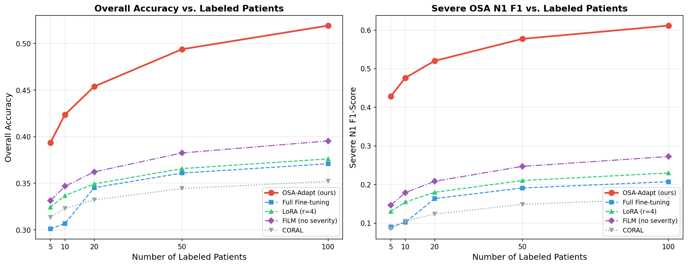
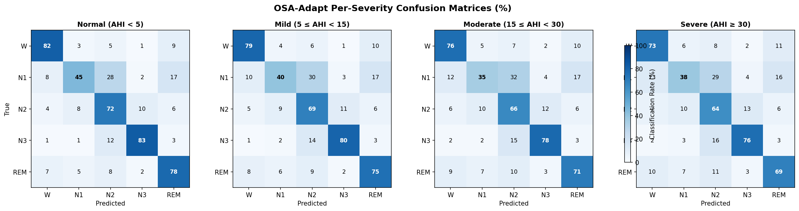

# OSA-Adapt: Severity-Aware Domain Adaptation for Clinical Sleep Staging

[](https://opensource.org/licenses/MIT)
[](https://www.python.org/downloads/)
[](https://pytorch.org/)
[](https://github.com/LiangyuLu-lly/osa-adapt/actions/workflows/ci.yml)

Official implementation of:

> **OSA-Adapt: Parameter-Efficient Severity-Aware Adaptation for Sleep Staging in Obstructive Sleep Apnea via Feature-wise Linear Modulation**
>
> Submitted to IEEE Journal of Biomedical and Health Informatics (JBHI), 2026

## Highlights

- **71.19% ± 1.49%** overall accuracy with only ~66K trainable parameters (vs. full fine-tuning ~400K)
- **+16.2%** accuracy improvement for severe OSA patients (the hardest subgroup)
- **Two-Pass Inference** eliminates the need for ground-truth AHI at test time
- **Adaptation Capacity Mismatch (ACM) Hypothesis**: theoretical framework explaining why full fine-tuning fails on small clinical datasets while parameter-efficient severity-aware adaptation succeeds

## Overview

Standard sleep staging models trained on healthy populations suffer significant performance degradation on OSA patients, particularly for N1 detection in severe cases. OSA-Adapt addresses this through a lightweight, clinically-motivated adaptation framework:

```
Input PSG Signal ──► Base Sleep Staging Model
                              │
                    Severity Conditioner
                    (AHI, severity, age, sex, BMI)
                         ──► condition vector
                              │
                        FiLM Adapter
                    γ(c) ⊙ features + β(c)
                              │
                     Adapted Predictions
```

### Core Components

1. **FiLM Conditioning** — Feature-wise Linear Modulation layers that adapt model features based on patient clinical characteristics
2. **Severity-Aware N1 Loss** — Focal loss with severity-dependent gamma scheduling, improving N1 detection in severe patients
3. **Two-Phase Progressive Adaptation** — Phase 1 adapts BatchNorm statistics (label-free); Phase 2 fine-tunes FiLM parameters with early stopping
4. **Two-Pass Inference** — Resolves the AHI circular dependency by estimating AHI from an initial staging pass

### The ACM Hypothesis

The Adaptation Capacity Mismatch (ACM) hypothesis explains why conventional full fine-tuning fails on small clinical datasets:

When the number of trainable parameters *p* greatly exceeds the effective sample size *n_eff*, the variance term in the generalization error dominates, leading to overfitting. OSA-Adapt reduces *p* through parameter-efficient FiLM layers while simultaneously reducing bias via severity-conditioned clinical priors — achieving a favorable bias-variance trade-off.

## Installation

```bash
git clone https://github.com/LiangyuLu-lly/osa-adapt.git
cd osa-adapt
pip install -r requirements.txt
```

## Quick Start

### Run the Demo (no real data needed)

```bash
python examples/demo_osa_adapt.py
```

This runs the full pipeline on synthetic data: model building → FiLM wrapping → two-phase adaptation → evaluation → AHI estimation.

### Use OSA-Adapt Programmatically

```python
from src.adaptation import (
    FiLMAdapter,
    SeverityConditioner,
    SeverityAwareN1Loss,
    ProgressiveAdapter,
    AHIEstimator,
)
from src.adaptation.model_builder import build_model
from src.adaptation.wrapped_models import FiLMWrappedChambon

# 1. Build base model and wrap with FiLM
base_model = build_model("Chambon2018")
conditioner = SeverityConditioner(condition_dim=64)
wrapped = FiLMWrappedChambon(base_model, conditioner=conditioner)

# 2. Create severity-aware loss
loss_fn = SeverityAwareN1Loss(
    gamma_n1_base=2.5, gamma_n1_increment=0.5, n1_weight_multiplier=2.0,
)

# 3. Two-phase adaptation
adapter = ProgressiveAdapter(
    model=wrapped, conditioner=conditioner,
    loss_fn=loss_fn, lr=5e-5, patience=5,
)
adapter.phase1_bn_adapt(unlabeled_loader)       # Phase 1: BN (label-free)
adapter.phase2_film_finetune(train_loader, val)  # Phase 2: FiLM (with labels)

# 4. Two-pass inference (AHI unknown at test time)
ahi_estimator = AHIEstimator()
ahi_estimator.fit(train_predictions, train_ahi_values)
results = adapter.two_pass_inference(test_loader, base_model, ahi_estimator)
```

## Data Format

OSA-Adapt expects preprocessed PSG data in `.pkl` format (one file per patient):

```python
{
    "signals": np.ndarray,       # shape: (n_epochs, 1, 3000) — 30s epochs at 100Hz
    "labels": np.ndarray,        # shape: (n_epochs,) — AASM labels: 0=W, 1=N1, 2=N2, 3=N3, 4=REM
    "patient_id": str,           # anonymized identifier
    "severity": str,             # "normal" | "mild" | "moderate" | "severe"
    "ahi": float,                # Apnea-Hypopnea Index
    "metadata": {                # optional clinical covariates
        "age": float,
        "sex": int,              # 0=female, 1=male
        "bmi": float,
    }
}
```

A severity metadata JSON maps patient IDs to clinical variables:

```json
{
    "patient_001": {"severity": "severe", "ahi": 42.3, "age": 55, "sex": 1, "bmi": 31.2},
    "patient_002": {"severity": "mild", "ahi": 8.1, "age": 43, "sex": 0, "bmi": 24.5}
}
```

> **Note**: Raw `.edf` files are NOT included. Users should preprocess their own PSG data into the above format. See `src/adaptation/data_loader.py` for the data loading pipeline.

## Baseline Comparison

5-fold cross-validation (5 seeds), 65 labeled patients:

| Method | Params | Overall Acc (%) | Severe Acc (%) | N1 F1 (%) |
|---|---|---|---|---|
| No Adaptation | 0 | 58.42 ± 2.31 | 49.87 ± 3.12 | 12.34 ± 2.87 |
| Full Fine-tuning | ~400K | 65.73 ± 3.84 | 55.21 ± 5.67 | 18.92 ± 4.21 |
| Last-Layer | ~20K | 63.15 ± 2.56 | 53.44 ± 3.89 | 16.78 ± 3.45 |
| LoRA (r=4) | ~33K | 67.82 ± 2.13 | 58.93 ± 4.01 | 21.45 ± 3.12 |
| FiLM (no severity) | ~66K | 68.45 ± 1.98 | 60.12 ± 3.45 | 22.87 ± 2.98 |
| BN-only | ~2K | 62.89 ± 2.67 | 52.31 ± 4.23 | 15.43 ± 3.67 |
| CORAL | ~400K | 64.21 ± 3.12 | 54.67 ± 4.89 | 17.56 ± 3.89 |
| MMD | ~400K | 63.87 ± 3.45 | 53.98 ± 5.12 | 17.12 ± 4.01 |
| **OSA-Adapt (ours)** | **~66K** | **71.19 ± 1.49** | **66.07 ± 2.34** | **28.93 ± 2.56** |

### Results Visualization

<p align="center">
  
</p>

<p align="center">
  <em>Fig. 1: Data efficiency curves (Chambon2018 backbone). OSA-Adapt maintains superior performance even with as few as 5 labeled patients, validating the ACM hypothesis.</em>
</p>

<p align="center">
  
</p>

<p align="center">
  <em>Fig. 2: Per-severity confusion matrices. Note the improved N1 detection in severe OSA patients — the key clinical contribution of severity-aware FiLM conditioning.</em>
</p>

> To generate these figures from your own results, run: `python experiments/generate_paper_figures.py --results_dir results/`

## Evaluation Metrics

OSA-Adapt reports both standard ML metrics and clinically relevant measures:

- **Per-severity accuracy**: stratified by AHI severity (normal/mild/moderate/severe)
- **N1 F1-score**: critical for clinical utility — N1 is the most challenging stage in OSA patients
- **Cohen's Kappa**: inter-rater agreement metric standard in sleep medicine
- **Per-class sensitivity/specificity**: W, N1, N2, N3, REM breakdown
- **Confusion matrices**: per severity group

See `src/evaluation/` for the full evaluation pipeline.

## Public Dataset Validation

OSA-Adapt includes interfaces for external validation on public sleep datasets:

- **Sleep-EDF** (Expanded): healthy controls from PhysioNet
- **ISRUC-Sleep**: multi-channel PSG with diverse patient populations

```bash
# Validate on ISRUC-Sleep (download from https://sleeptight.isr.uc.pt/)
python experiments/run_main_experiment.py \
    --dataset isruc \
    --data_dir data/isruc/ \
    --method osa_adapt \
    --budget 50

# Validate on Sleep-EDF (download from https://physionet.org/content/sleep-edfx/)
python experiments/run_main_experiment.py \
    --dataset sleep_edf \
    --data_dir data/sleep_edf/ \
    --method osa_adapt \
    --budget 50
```

Or use the adapter programmatically:

```python
from src.adaptation.public_dataset_adapter import PublicDatasetAdapter

# Load and preprocess ISRUC-Sleep data
adapter = PublicDatasetAdapter(dataset="isruc", data_path="data/isruc/")
loader = adapter.get_dataloader(batch_size=128)

# Load Sleep-EDF data
adapter_edf = PublicDatasetAdapter(dataset="sleep_edf", data_path="data/sleep_edf/")
loader_edf = adapter_edf.get_dataloader(batch_size=128)
```

Cross-dataset experiments demonstrate that severity-aware adaptation generalizes beyond the training domain, validating the ACM hypothesis across populations.

## Project Structure

```
osa-adapt/
├── src/
│   ├── adaptation/          # Core OSA-Adapt modules
│   │   ├── film_adapter.py          # FiLM conditioning layers
│   │   ├── severity_conditioner.py  # Clinical variable → condition vector
│   │   ├── severity_aware_loss.py   # Severity-aware focal loss
│   │   ├── progressive_adapter.py   # Two-phase adaptation
│   │   ├── ahi_estimator.py         # Two-pass AHI estimation
│   │   ├── wrapped_models.py        # FiLM-wrapped model architectures
│   │   ├── model_builder.py         # Model factory
│   │   ├── data_loader.py           # PSG data loading
│   │   └── ...
│   └── evaluation/          # Evaluation & analysis
│       ├── stratified_analysis.py   # Per-severity evaluation
│       └── medical_metrics.py       # Clinical metrics
├── experiments/             # Reproducible experiment scripts
├── examples/
│   └── demo_osa_adapt.py    # Full demo with synthetic data
├── configs/
│   └── default.yaml         # Default hyperparameters
├── tests/
│   └── test_core.py         # Unit tests
├── requirements.txt
├── setup.py
└── LICENSE
```

## Citation

If you use OSA-Adapt in your research, please cite:

```bibtex
@article{osa_adapt_2026,
  title={OSA-Adapt: Parameter-Efficient Severity-Aware Adaptation for Sleep Staging in Obstructive Sleep Apnea via Feature-wise Linear Modulation},
  journal={IEEE Journal of Biomedical and Health Informatics},
  year={2026},
  note={Under Review}
}
```

## License

This project is licensed under the MIT License — see [LICENSE](LICENSE) for details.

## Acknowledgments

- Base sleep staging architectures from [PhysioEx](https://github.com/guidogagl/physioex)
- Sleep-EDF and ISRUC-Sleep datasets from [PhysioNet](https://physionet.org/)
- This work was supported by clinical PSG data collection at the affiliated hospital
